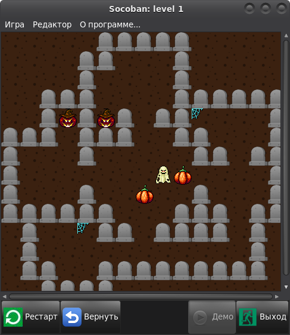

# lazsokoban

Ще один клон класичної японської головоломки, написаний на FPC/Lazarus.

Можливості:

- [+] демонстрація проходження рівня (при наявності файла прохождения)
- [+] відміна ходів
- [-] збереження/завантаження гры (в розробці)
- [-] таблиця рекордів для кожного рівня (в розробці)
- [+] редактор рівнів (часткова функціональність)
- [+] підтримка скінів
- [-] підтримка наборів рівнів (в розробці)

DEV.LOG
=

"+" - додано нові можливості

"*" - внесено зміни

"!" - виправлено помилку

"-" - видалено непотрібний функціонал

04.08.2014
* Проект опубліковано на Google Code, постоянная ссылка SVN репозитория:
svn checkout http://lazsokoban.googlecode.com/svn/trunk/ lazsokoban-read-only
28.08.2014
! Виправлено збільшення ширини/висоти рівня в редакторі
13.03.2015
* Репозиторій перенесено на Github
04.04.2015
* Поправлено розміщення полів в вікні редактора
15.12.2021
+ Додано можливість використовувати скіни
+ Додано новорічний скін з Сантою
18.12.2021
* Змінено структуру папок проекту, по замовчуванню виставлено новорічний скін
24.04.2022
+ Додано скін "Easter"
30.10.2022
+ Додано скін "Halloween"
* Документацію перекладено на українську мову
